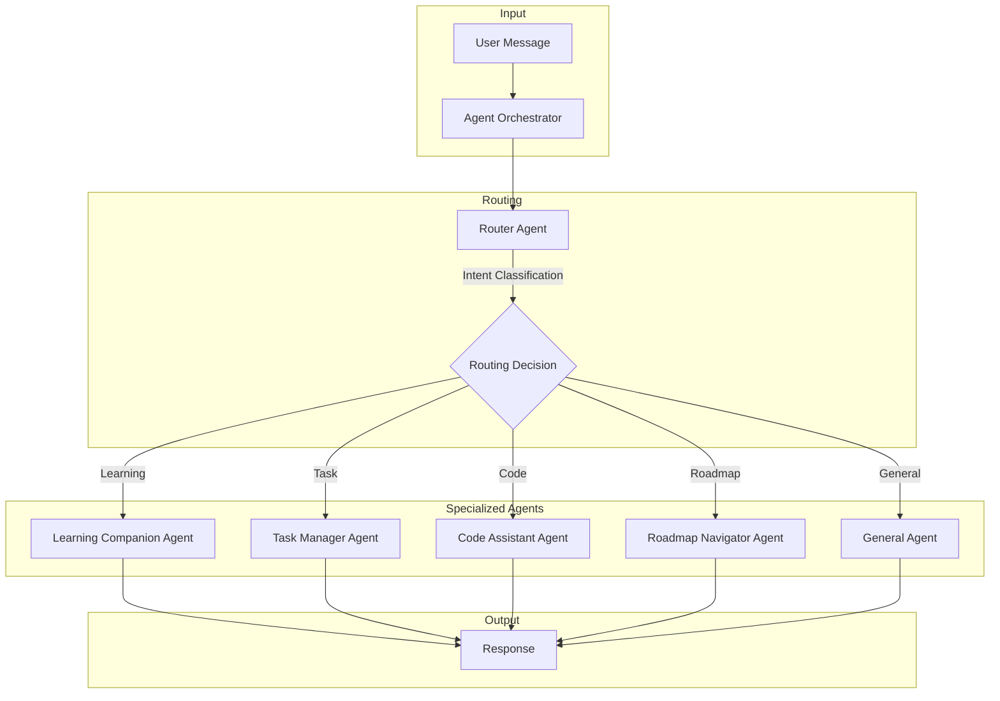
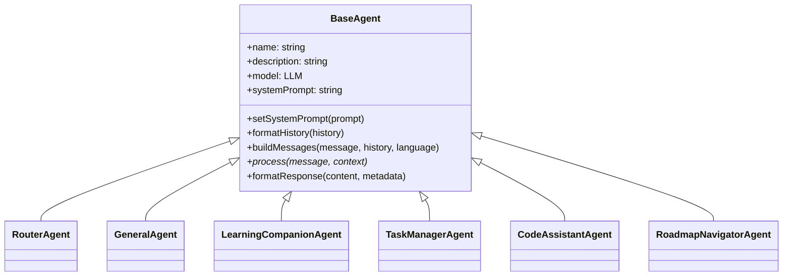
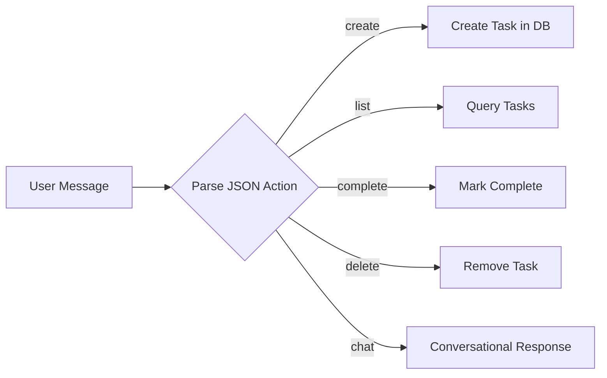
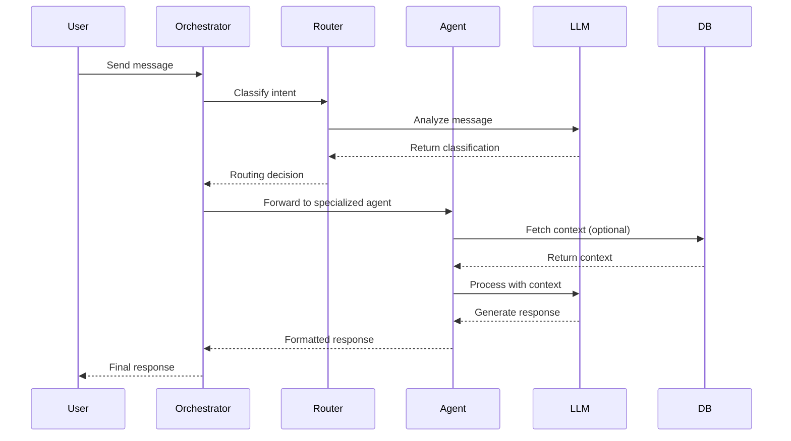

# Inherit - Agentic System Architecture

> A **LangGraph-powered multi-agent system** designed for intelligent CS student learning assistance on the Inherit platform.

---

## 📋 Overview

The Inherit agentic system is built using **LangGraph** to create a sophisticated multi-agent workflow. It intelligently routes user messages to specialized agents based on intent classification, providing contextual and domain-specific responses.



---

## 🏗️ Core Components

### 1. Agent Orchestrator

**File:** [`agentOrchestrator.js`](file:///e:/Projects/inherit/lib/agents/agentOrchestrator.js)

The orchestrator is the central brain of the system, built on **LangGraph's StateGraph**. It manages the workflow state and coordinates message routing.

| Feature | Description |
|---------|-------------|
| **State Management** | Tracks messages, current agent, routing decisions, and context |
| **Graph Building** | Creates a compiled LangGraph workflow with `route` → `process` nodes |
| **Singleton Pattern** | Ensures a single orchestrator instance throughout the application |

**Graph State Schema:**
```javascript
{
  messages: [],        // Conversation history
  currentAgent: null,  // Active agent type
  routingDecision: null, // Router's decision object
  response: null,      // Final response
  language: "en",      // Response language (en/bn)
  context: {}          // Additional context data
}
```

**Workflow Flow:**
```
START → route → process → END
```

---

### 2. Base Agent

**File:** [`baseAgent.js`](file:///e:/Projects/inherit/lib/agents/baseAgent.js)

Abstract base class that all specialized agents extend. Provides shared functionality:

- **Message Formatting**: Converts history to LangChain message objects (`HumanMessage`, `AIMessage`, `SystemMessage`)
- **Language Support**: Handles bilingual responses (English/Bengali)
- **Response Standardization**: Consistent response format with agent name, content, and timestamp



---

### 3. Router Agent

**File:** [`routerAgent.js`](file:///e:/Projects/inherit/lib/agents/routerAgent.js)

The **intent classifier** that determines which specialized agent should handle each message.

| Agent Type | Triggers |
|------------|----------|
| `learning` | Concept explanations, CS topics, tutorials, programming concepts |
| `task` | Task creation, reminders, deadlines, scheduling |
| `code` | Debugging, code review, error explanations, code examples |
| `roadmap` | Learning path queries, progress tracking, career guidance |
| `general` | Greetings, small talk, unclear queries, fallback |

**Output Format:**
```json
{
  "agent": "learning",
  "confidence": 0.95,
  "reasoning": "Concept explanation request"
}
```

---

## 🤖 Specialized Agents

### Learning Companion Agent

**File:** [`learningCompanionAgent.js`](file:///e:/Projects/inherit/lib/agents/learningCompanionAgent.js)

| Purpose | Explain CS concepts with clear examples |
|---------|----------------------------------------|
| **Model** | Gemini Learning Model |
| **Context Awareness** | Current roadmap, active quest |
| **Features** | Socratic method, topic extraction, bilingual support |

**Capabilities:**
- Programming concept explanations
- CS theory (algorithms, data structures, OS, networks)
- Problem-solving guidance
- Learning resource recommendations

---

### Task Manager Agent

**File:** [`taskManagerAgent.js`](file:///e:/Projects/inherit/lib/agents/taskManagerAgent.js)

| Purpose | Manage study tasks and deadlines |
|---------|----------------------------------|
| **Model** | Gemini Task Model |
| **Database** | MongoDB (Task model) |
| **Operations** | Create, List, Update, Complete, Delete |

**Task Schema:**
```javascript
{
  title: string,
  category: "study" | "assignment" | "project" | "revision" | "exam" | "other",
  priority: "high" | "medium" | "low",
  dueDate: Date,
  description: string
}
```

**Action Flow:**


---

### Code Assistant Agent

**File:** [`codeAssistantAgent.js`](file:///e:/Projects/inherit/lib/agents/codeAssistantAgent.js)

| Purpose | Debug code and provide programming help |
|---------|----------------------------------------|
| **Model** | Gemini Code Model |
| **Language Detection** | JavaScript, Python, Java, C++, TypeScript, SQL, HTML, CSS |

**Query Classification:**
- `debug` - Error fixing, bug hunting
- `review` - Code improvement, optimization
- `explain` - Code explanation
- `generate` - Code creation

**Response Format:**
```markdown
## Problem Identified
## Explanation
## Solution
## Code Example
```

---

### Roadmap Navigator Agent

**File:** [`roadmapNavigatorAgent.js`](file:///e:/Projects/inherit/lib/agents/roadmapNavigatorAgent.js)

| Purpose | Guide users through learning paths |
|---------|-----------------------------------|
| **Model** | Gemini Task Model |
| **Database** | MongoDB (Roadmap model) |
| **Context** | User's roadmap progress |

**Features:**
- Progress tracking and visualization
- Next topic suggestions
- Career guidance integration
- Prerequisite explanations

---

### General Agent

**File:** [`generalAgent.js`](file:///e:/Projects/inherit/lib/agents/generalAgent.js)

| Purpose | Handle general conversation and platform guidance |
|---------|--------------------------------------------------|
| **Model** | Gemini Learning Model |
| **Fallback** | Default agent for unclear intents |

**Response Types:**
- `greeting` - Welcome messages
- `gratitude` - Thank you responses
- `help` - Platform navigation
- `support` - Motivational support

---

## 🔄 Data Flow



---

## 📁 File Structure

```
lib/agents/
├── index.js                    # Agent exports & initialization
├── agentOrchestrator.js        # LangGraph workflow orchestrator
├── baseAgent.js                # Abstract base class
├── routerAgent.js              # Intent classification router
├── generalAgent.js             # General conversation handler
├── learningCompanionAgent.js   # CS learning assistant
├── taskManagerAgent.js         # Task management with DB ops
├── codeAssistantAgent.js       # Code debugging & review
└── roadmapNavigatorAgent.js    # Learning path navigator
```

---

## 🚀 Initialization

**File:** [`index.js`](file:///e:/Projects/inherit/lib/agents/index.js)

```javascript
import { getInitializedOrchestrator } from "./agents";

// Get the singleton orchestrator (lazy initialization)
const orchestrator = getInitializedOrchestrator();

// Process a user message
const result = await orchestrator.processMessage(
  "Explain recursion in Python",
  {
    history: [],
    language: "en",
    context: { clerkId: "user_123" }
  }
);
```

**Response Structure:**
```javascript
{
  response: {
    agent: "learning",
    content: "...",
    timestamp: "2026-01-10T...",
    topic: "recursion"
  },
  routedTo: "learning",
  routing: {
    agent: "learning",
    confidence: 0.95,
    reasoning: "Concept explanation request"
  }
}
```

---

## 🔑 Key Design Patterns

| Pattern | Usage |
|---------|-------|
| **Singleton** | Orchestrator instance shared across the app |
| **Strategy** | Each agent implements different processing strategies |
| **Template Method** | BaseAgent defines the processing skeleton |
| **State Machine** | LangGraph manages workflow state transitions |

---

## 🌐 Language Support

The system supports **bilingual responses** (English and Bengali):

```javascript
// Language is passed through context
await orchestrator.processMessage("ব্যাখ্যা করো recursion", {
  language: "bn"  // Responds in Bengali
});
```

---

## 📊 Models Used

| Agent | Model Provider | Purpose |
|-------|----------------|---------|
| Router | Gemini Router Model | Fast intent classification |
| Learning | Gemini Learning Model | Concept explanations |
| Task | Gemini Task Model | Task management |
| Code | Gemini Code Model | Code analysis |
| Roadmap | Gemini Task Model | Path navigation |
| General | Gemini Learning Model | Conversation |

---

## 🛡️ Error Handling

Each agent implements graceful error handling:
- Bilingual error messages
- Fallback to General Agent on routing failures
- Low confidence routing defaults to General Agent

---

> **Built for Inherit** - An AI-powered learning platform for CS students 🎓
