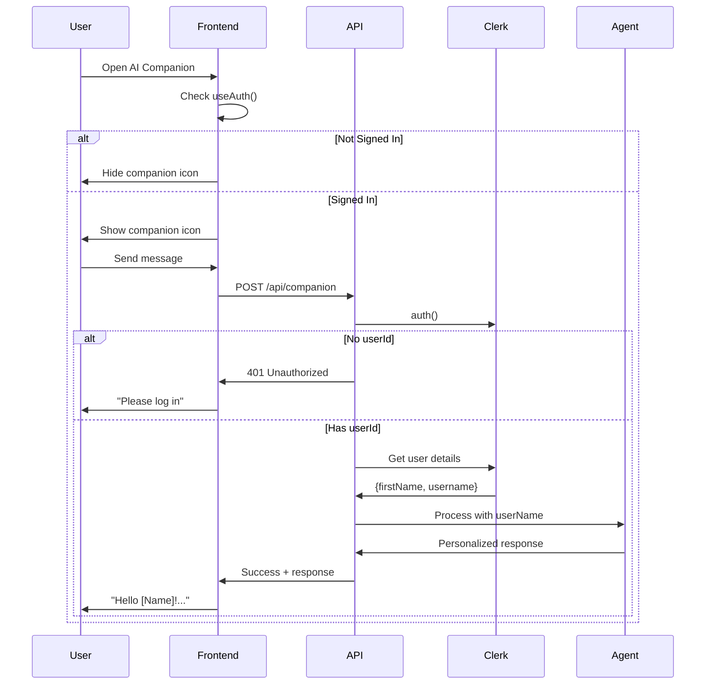

# AI Companion Authentication & Personalization

## Changes Implemented

### 1. Authentication Requirements

#### API Level Protection
**File: `app/api/companion/route.js`**

- Added **required authentication** for POST requests
- Companion now only works for logged-in users
- Returns 401 error with user-friendly message when not authenticated

```javascript
// Require authentication for companion
if (!userId) {
  return errorResponse(
    { message: "Authentication required. Please log in to use the AI companion." },
    requestId,
    401
  );
}
```

#### User Details Integration
- Import `clerkClient` to fetch user information
- Retrieve user's `firstName`, `username`, or default to "there"
- Pass `userName` to agent orchestrator for personalized responses

```javascript
// Get user details for personalized responses
let userName = "there";
try {
  const user = await clerkClient.users.getUser(userId);
  userName = user.firstName || user.username || "there";
} catch (error) {
  logger.warn("Failed to fetch user details", { userId, error: error.message });
}
```

### 2. Personalized Greetings

#### General Agent Updates
**File: `lib/agents/generalAgent.js`**

- Extract `userName` from context
- Add personalized prompt with user's name
- Model uses name in greetings for personal touch

```javascript
const { history = [], language = "en", userName = "there" } = context;

// Add user name to system prompt for personalized greetings
const personalizedPrompt = this.systemPrompt + `\n\nUser's name: ${userName}. When greeting them, use their name to make it personal.`;
```

#### i18n Message Updates
**File: `lib/i18n/agentMessages.js`**

- Updated greeting messages to support `{name}` variable
- Works in both English and Bengali

```javascript
greetings: {
  welcome: {
    en: "Hello {name}! I'm your AI learning companion. How can I help you today?",
    bn: "হ্যালো {name}! আমি আপনার এআই লার্নিং সহকারী। আজ আমি কিভাবে সাহায্য করতে পারি?"
  },
  warmWelcome: {
    en: "Hi {name}! Ready to learn something new?",
    bn: "হাই {name}! নতুন কিছু শিখতে প্রস্তুত?"
  }
}
```

### 3. Frontend Protection

#### AICompanion Component
**File: `components/companion/AICompanion.jsx`**

**Changes:**
1. Import `useAuth` from Clerk and `usePathname` from Next.js
2. Check authentication status before rendering
3. Hide companion on public routes (home, sign-in, sign-up)
4. Show user-friendly error when trying to use without login

```javascript
const { isSignedIn, isLoaded } = useAuth();
const pathname = usePathname();

// Don't render companion on public routes or when not authenticated
if (!isLoaded) return null;  // Loading auth state
if (!isSignedIn) return null;  // Not authenticated
if (PUBLIC_ROUTES.includes(pathname)) return null;  // On public route
```

**Enhanced Error Handling:**
```javascript
// Check if authentication error
if (error.message && error.message.includes("Authentication required")) {
  setMessages((prev) => [
    ...prev,
    {
      role: "assistant",
      content: language === "bn"
        ? "দুঃখিত, AI সহকারী ব্যবহার করতে আপনাকে লগইন করতে হবে। অনুগ্রহ করে লগইন করুন।"
        : "Sorry, you need to be logged in to use the AI companion. Please sign in to continue.",
      timestamp: new Date().toISOString(),
      error: true,
    },
  ]);
  return;
}
```

### 4. User-Friendly Task Tool Messages

#### Task Tools Updates
**File: `lib/agents/tools/taskTools.js`**

Updated all authentication error messages to be conversational and helpful:

**Before:**
```javascript
message: "User authentication required to create tasks"
```

**After:**
```javascript
message: "I was unable to create the task for you. It seems like user authentication is required. Please make sure you are logged in."
```

**Updated Tools:**
- `create_task` - "I was unable to create the task for you..."
- `list_tasks` - "I was unable to retrieve your tasks..."
- `update_task` - "I was unable to update the task..."
- `delete_task` - "I was unable to delete the task..."
- `complete_task` - "I was unable to mark the task as complete..."
- `get_deadlines` - "I was unable to retrieve deadlines..."

## User Experience Flow

### Authenticated User
```
1. User logs in → Navigate to dashboard
2. AI Companion icon appears (bottom right)
3. Click to open chat
4. First message: "Hello [User's Name]! I'm your AI learning companion..."
5. Can use all features: tasks, learning, code assistance
6. All greetings personalized with user's name
```

### Unauthenticated User
```
1. User on landing page (/)
2. AI Companion icon NOT visible
3. If user somehow accesses API:
   → 401 error: "Authentication required. Please log in..."
4. Friendly message in chat: "Please sign in to continue"
```

## Protected Routes

### Public Routes (No Companion)
- `/` - Landing page
- `/sign-in` - Sign in page
- `/sign-up` - Sign up page

### Protected Routes (Companion Available)
- `/dashboard` - Dashboard
- `/learn` - Learning videos
- `/roadmaps` - Learning roadmaps
- `/quests` - Coding challenges
- `/playground` - Code editor
- `/tasks` - Task management
- `/dev-discuss` - Community discussions
- All other authenticated routes

## Technical Implementation

### Authentication Flow


### Context Passing
```javascript
// API → Orchestrator
orchestrator.processMessage(message, {
  history,
  language,
  clerkId: userId,
  userName: "John",  // ← User's name
  ...context,
});

// Orchestrator → Agent
agent.process(message, {
  history,
  language,
  clerkId: userId,
  userName: "John",  // ← Passed to agent
});

// Agent → Model
const personalizedPrompt = this.systemPrompt + 
  `\n\nUser's name: ${userName}. When greeting them, use their name.`;
```

## Security Considerations

### Multi-Layer Protection

1. **Frontend Level**
   - Component doesn't render for unauthenticated users
   - Hidden on public routes
   - Visual feedback only

2. **API Level**
   - Required userId check
   - 401 response for missing auth
   - Primary security boundary

3. **Tool Level**
   - All task tools verify clerkId
   - User-specific data queries
   - Prevents data leakage

### Data Isolation
```javascript
// All task queries include clerkId filter
const tasks = await Task.find({ 
  clerkId,  // ← Ensures user only sees their data
  status: "pending" 
});
```

## Testing Checklist

- [x] Companion hidden on landing page (/)
- [x] Companion hidden on sign-in page
- [x] Companion hidden on sign-up page
- [x] Companion visible on dashboard (authenticated)
- [x] Personalized greeting with user's name
- [x] Task creation requires authentication
- [x] Task listing requires authentication
- [x] User-friendly error messages
- [x] 401 response for unauthenticated API calls
- [x] Conversation saved only for authenticated users

## Benefits

### For Users
✅ Personalized experience with name recognition  
✅ Clear feedback when authentication required  
✅ No confusion on public pages  
✅ Secure access to personal data (tasks)  

### For System
✅ Data isolation and security  
✅ Proper authentication enforcement  
✅ Better error handling  
✅ Clean UX with conditional rendering  

### For Developers
✅ Multi-layer protection  
✅ Easy to extend with more personalization  
✅ Clear authentication flow  
✅ Maintainable code structure  

## Future Enhancements

### 1. User Preferences
```javascript
// Store user preferences
const userPrefs = await UserPreferences.findOne({ clerkId });
context.preferredLanguage = userPrefs.language;
context.learningGoals = userPrefs.goals;
```

### 2. Conversation Continuity
```javascript
// Load last conversation on open
const lastConversation = await Conversation.findOne({ clerkId })
  .sort({ updatedAt: -1 });
setMessages(lastConversation.messages);
```

### 3. Context-Aware Greetings
```javascript
// Different greetings based on context
if (currentTime.hour < 12) {
  greeting = `Good morning ${userName}!`;
} else if (currentTime.hour < 18) {
  greeting = `Good afternoon ${userName}!`;
} else {
  greeting = `Good evening ${userName}!`;
}
```

### 4. Activity-Based Personalization
```javascript
// Reference recent activity
if (recentActivity.completedQuest) {
  greeting = `Great job on completing ${questName}, ${userName}! What's next?`;
}
```

## Conclusion

The AI Companion is now:
- **Secure** - Only available to authenticated users
- **Personal** - Greets users by name
- **User-Friendly** - Clear error messages
- **Well-Protected** - Multi-layer authentication checks

All authentication requirements are properly enforced while maintaining a smooth, personalized user experience.
